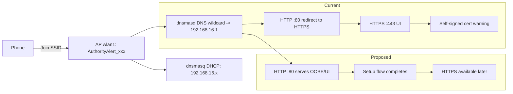

## 1) Inventory: remaining “reCamera/recamera” branding + where it lives

### OS / Buildroot identity
- Buildroot hostname defaults to **reCamera**: [`reCamera-OS/external/buildroot/configs/cvitek_CV181X_musl_riscv64_defconfig:186`](reCamera-OS/external/buildroot/configs/cvitek_CV181X_musl_riscv64_defconfig:186)
- Default system user is **recamera**: [`reCamera-OS/external/buildroot/board/cvitek/CV181X/users_table.txt:5`](reCamera-OS/external/buildroot/board/cvitek/CV181X/users_table.txt:5)

### Wi‑Fi AP naming
- AP SSID now set to `AuthorityAlert` marker in hostapd templates:
  - [`reCamera-OS/external/buildroot/board/cvitek/CV181X/overlay/etc/hostapd_2g4.conf:3`](reCamera-OS/external/buildroot/board/cvitek/CV181X/overlay/etc/hostapd_2g4.conf:3)
  - [`reCamera-OS/external/buildroot/board/cvitek/CV181X/overlay/etc/hostapd_5g.conf:3`](reCamera-OS/external/buildroot/board/cvitek/CV181X/overlay/etc/hostapd_5g.conf:3)
- Supervisor AP SSID mutation uses `AuthorityAlert_<suffix>`: [`sscma-example-sg200x/solutions/supervisor/internal/network/wifi.go:151`](sscma-example-sg200x/solutions/supervisor/internal/network/wifi.go:151)

### Captive portal plumbing
- dnsmasq serves DHCP/DNS on wlan1 and does wildcard DNS to `192.168.16.1` (good for captive portal): [`reCamera-OS/external/buildroot/board/cvitek/CV181X/overlay/etc/dnsmasq/default.conf:3`](reCamera-OS/external/buildroot/board/cvitek/CV181X/overlay/etc/dnsmasq/default.conf:3) through [`reCamera-OS/external/buildroot/board/cvitek/CV181X/overlay/etc/dnsmasq/default.conf:8`](reCamera-OS/external/buildroot/board/cvitek/CV181X/overlay/etc/dnsmasq/default.conf:8)
- But in the USB+WiFi config, the wildcard DNS is currently commented out (portal behavior becomes less reliable when USB is “configured”): [`reCamera-OS/external/buildroot/board/cvitek/CV181X/overlay/etc/dnsmasq/usb_wlan1.conf:8`](reCamera-OS/external/buildroot/board/cvitek/CV181X/overlay/etc/dnsmasq/usb_wlan1.conf:8)

### mDNS / Avahi
- Avahi hostname is now `authorityalert.local`: [`reCamera-OS/external/buildroot/board/cvitek/CV181X/overlay/etc/avahi/avahi-daemon.conf:2`](reCamera-OS/external/buildroot/board/cvitek/CV181X/overlay/etc/avahi/avahi-daemon.conf:2)
- mDNS web service advertisement added (`_http._tcp` / `_https._tcp`): [`reCamera-OS/external/buildroot/board/cvitek/CV181X/overlay/etc/avahi/services/authorityalert-web.service:9`](reCamera-OS/external/buildroot/board/cvitek/CV181X/overlay/etc/avahi/services/authorityalert-web.service:9) - [`reCamera-OS/external/buildroot/board/cvitek/CV181X/overlay/etc/avahi/services/authorityalert-web.service:16`](reCamera-OS/external/buildroot/board/cvitek/CV181X/overlay/etc/avahi/services/authorityalert-web.service:16)

### Supervisor TLS / cert branding
- TLS device-name fallback is “reCamera”: [`sscma-example-sg200x/solutions/supervisor/internal/tls/tls.go:145`](sscma-example-sg200x/solutions/supervisor/internal/tls/tls.go:145)
- Certificate SAN includes `recamera` + `recamera.local`: [`sscma-example-sg200x/solutions/supervisor/internal/tls/tls.go:216`](sscma-example-sg200x/solutions/supervisor/internal/tls/tls.go:216)

### Web UI branding + update endpoints
- Supervisor web UI still checks Seeed’s `recamera-os` GitHub releases: [`sscma-example-sg200x/solutions/supervisor/www/src/layout/main.tsx:28`](sscma-example-sg200x/solutions/supervisor/www/src/layout/main.tsx:28)
- UI copy still says “reCamera …”: [`sscma-example-sg200x/solutions/supervisor/www/src/layout/main.tsx:86`](sscma-example-sg200x/solutions/supervisor/www/src/layout/main.tsx:86)
- About screen shows “reCamera S1”: [`sscma-example-sg200x/solutions/supervisor/www/src/views/about/index.tsx:78`](sscma-example-sg200x/solutions/supervisor/www/src/views/about/index.tsx:78)

### Default credentials / user naming
- Supervisor web UI default username is “recamera”: [`sscma-example-sg200x/solutions/supervisor/www/src/views/login/index.tsx:145`](sscma-example-sg200x/solutions/supervisor/www/src/views/login/index.tsx:145)
- UI copy states default password “recamera”: [`sscma-example-sg200x/solutions/supervisor/www/src/views/login/index.tsx:180`](sscma-example-sg200x/solutions/supervisor/www/src/views/login/index.tsx:180)
- ttyd default user “recamera”: [`reCamera-OS/external/buildroot/board/cvitek/CV181X/overlay/etc/init.d/S98ttyd:17`](reCamera-OS/external/buildroot/board/cvitek/CV181X/overlay/etc/init.d/S98ttyd:17)

### Node-RED branding
- Node-RED editor title is “reCamera”: [`reCamera-OS/external/buildroot/board/cvitek/CV181X/overlay/usr/lib/node_modules/node-red/settings.js:382`](reCamera-OS/external/buildroot/board/cvitek/CV181X/overlay/usr/lib/node_modules/node-red/settings.js:382)

## 2) Concrete repo changes to improve first‑run discovery + setup UX (code-level)

### Goal A — Reliable captive portal on iOS/Android/Windows/macOS (plain HTTP:80, no HTTPS redirect)

**Problem today:** wildcard DNS + HTTP→HTTPS redirect leads to self-signed HTTPS during OS “connectivity checks”, which is not what captive-portal detectors expect.

**Change A1 (supervisor): serve the setup UI on HTTP:80 for AP clients instead of redirecting to HTTPS.**
- Current redirect-only behavior: [`sscma-example-sg200x/solutions/supervisor/internal/server/server.go:98`](sscma-example-sg200x/solutions/supervisor/internal/server/server.go:98) - [`sscma-example-sg200x/solutions/supervisor/internal/server/server.go:103`](sscma-example-sg200x/solutions/supervisor/internal/server/server.go:103)

**Recommended code-level modification:**
- In [`sscma-example-sg200x/solutions/supervisor/internal/server/server.go`](sscma-example-sg200x/solutions/supervisor/internal/server/server.go:1)
  - Keep HTTPS server as-is.
  - Replace the HTTP server `Handler` with a new handler that:
    - If `r.RemoteAddr` is in `192.168.16.0/24` (AP clients), serve the same `rootMux` content over HTTP **without redirect**.
    - Otherwise (LAN/WAN), keep redirect behavior.

**Pseudo-change (exact area):**
- Replace the assignment at [`sscma-example-sg200x/solutions/supervisor/internal/server/server.go:101`](sscma-example-sg200x/solutions/supervisor/internal/server/server.go:101) - [`sscma-example-sg200x/solutions/supervisor/internal/server/server.go:105`](sscma-example-sg200x/solutions/supervisor/internal/server/server.go:105) so HTTP uses `rootMux` for AP clients.

**Why this works:**
- iOS/Android do HTTP requests to known URLs; with wildcard DNS they hit `192.168.16.1`; returning HTTP 200 with your setup page reliably triggers “Sign in to Wi‑Fi network” without certificate friction.

**Change A2 (dnsmasq): keep wildcard DNS on wlan1 in *all* AP modes.**
- Today it’s enabled in default.conf but disabled for USB+WiFi mode.

Edits:
- Un-comment wildcard DNS in:
  - [`reCamera-OS/external/buildroot/board/cvitek/CV181X/overlay/etc/dnsmasq/usb_wlan1.conf:8`](reCamera-OS/external/buildroot/board/cvitek/CV181X/overlay/etc/dnsmasq/usb_wlan1.conf:8)

**Change A3 (dnsmasq): advertise the portal URL via DHCP option 114 (RFC 8910).**
This is increasingly supported and helps some clients jump directly to the portal.

Edits:
- Add to both:
  - [`reCamera-OS/external/buildroot/board/cvitek/CV181X/overlay/etc/dnsmasq/default.conf:1`](reCamera-OS/external/buildroot/board/cvitek/CV181X/overlay/etc/dnsmasq/default.conf:1)
  - [`reCamera-OS/external/buildroot/board/cvitek/CV181X/overlay/etc/dnsmasq/usb_wlan1.conf:1`](reCamera-OS/external/buildroot/board/cvitek/CV181X/overlay/etc/dnsmasq/usb_wlan1.conf:1)

Suggested lines (near the wlan1 dhcp-option lines):
- `dhcp-option=set:wlan1,114,http://192.168.16.1/`
  - Keep it IP-based so it works even if `.local` resolution is slow.

**Verification for Goal A (on device):**
- Connect phone to `AuthorityAlert_<suffix>`.
- Confirm lease is `192.168.16.x`, gateway/DNS `192.168.16.1` (client network details).
- Confirm portal auto-opens:
  - iOS: should show “Sign in to Wi‑Fi network” shortly after connect.
  - Android: should show “Sign in to network”.
  - Windows/macOS: opening any HTTP URL should land on portal because of wildcard DNS.
- Confirm no TLS/cert warning is required for initial setup because it’s plain HTTP.

### Goal B — Consistent device naming across AP SSID, mDNS hostname, and UI

**Problem today:**
- AP SSID is unique (`AuthorityAlert_<suffix>`), but hostname/mDNS is currently static `authorityalert.local`, which will collide if multiple devices are present.

**Change B1 (overlay/init): compute a stable suffix and set system hostname at boot**
- Buildroot default hostname is still `reCamera`: [`reCamera-OS/external/buildroot/configs/cvitek_CV181X_musl_riscv64_defconfig:186`](reCamera-OS/external/buildroot/configs/cvitek_CV181X_musl_riscv64_defconfig:186)

Recommended overlay changes:
1) Update Buildroot hostname baseline:
- Change to `authorityalert` in [`reCamera-OS/external/buildroot/configs/cvitek_CV181X_musl_riscv64_defconfig`](reCamera-OS/external/buildroot/configs/cvitek_CV181X_musl_riscv64_defconfig:186)

2) Add a new init script under overlay to set a unique hostname:
- Add: `reCamera-OS/external/buildroot/board/cvitek/CV181X/overlay/etc/init.d/S06device-identity`
- Behavior:
  - read MAC from `/sys/class/net/wlan0/address` (stable) or `eth0` if present
  - `suffix=$(mac | last 3 bytes)`
  - `name="authorityalert-${suffix}"`
  - `hostname "$name"`
  - write `/etc/hostname` and `/etc/recamera.conf/device_name` so supervisor TLS CN and UI name align with mDNS.

3) Avahi: prefer using system hostname rather than hardcoding `host-name=`
- In [`reCamera-OS/external/buildroot/board/cvitek/CV181X/overlay/etc/avahi/avahi-daemon.conf`](reCamera-OS/external/buildroot/board/cvitek/CV181X/overlay/etc/avahi/avahi-daemon.conf:1)
  - Remove (or comment) `host-name=...` so Avahi uses the system hostname.

**Verification for Goal B:**
- After boot, verify hostname:
  - `hostname` → `authorityalert-<suffix>`
- Verify mDNS:
  - From laptop on the AP: `ping authorityalert-<suffix>.local`
  - Browse services: `avahi-browse -art` should show `_http._tcp` / `_https._tcp` with that hostname.
- Verify AP SSID matches the same suffix (it already uses wlan1 MAC suffix via supervisor): [`sscma-example-sg200x/solutions/supervisor/internal/network/wifi.go:151`](sscma-example-sg200x/solutions/supervisor/internal/network/wifi.go:151)

### Goal C — Certificates and HTTPS behavior (reduce friction)

**Change C1 (supervisor TLS SANs): replace recamera names with authorityalert names**
- Current SAN list includes `recamera` + `recamera.local`: [`sscma-example-sg200x/solutions/supervisor/internal/tls/tls.go:216`](sscma-example-sg200x/solutions/supervisor/internal/tls/tls.go:216)

Recommended edit:
- Change SAN set to include:
  - `authorityalert`, `authorityalert.local`, and also the computed unique name (from `/etc/recamera.conf/device_name`).
- Replace the fallback “reCamera” with “AuthorityAlert” (or better: a stable default like `authorityalert`): [`sscma-example-sg200x/solutions/supervisor/internal/tls/tls.go:145`](sscma-example-sg200x/solutions/supervisor/internal/tls/tls.go:145)

**Important operational note:** once a cert is generated it is reused; to pick up SAN changes you must delete `/etc/recamera.conf/certs/server.crt` + `/etc/recamera.conf/certs/server.key` on a device or bump logic.

**Verification:**
- `openssl s_client -connect 192.168.16.1:443 -showcerts` shows SANs include authorityalert names.

### Goal D — Web UI + OTA/update endpoint branding cleanup

**Change D1 (supervisor web UI update checker): point to your repo**
- Current URL: [`sscma-example-sg200x/solutions/supervisor/www/src/layout/main.tsx:28`](sscma-example-sg200x/solutions/supervisor/www/src/layout/main.tsx:28)

Recommended edit:
- Replace with `https://api.github.com/repos/ThePoliceRecord/authority-alert/releases/latest` (or your canonical repo).
- Update the UI strings/links: [`sscma-example-sg200x/solutions/supervisor/www/src/layout/main.tsx:86`](sscma-example-sg200x/solutions/supervisor/www/src/layout/main.tsx:86) and [`sscma-example-sg200x/solutions/supervisor/www/src/layout/main.tsx:90`](sscma-example-sg200x/solutions/supervisor/www/src/layout/main.tsx:90)

**Change D2 (about screen): remove remaining “reCamera” hardware label**
- Replace “reCamera S1” in [`sscma-example-sg200x/solutions/supervisor/www/src/views/about/index.tsx:78`](sscma-example-sg200x/solutions/supervisor/www/src/views/about/index.tsx:78) with your actual model naming.

### Goal E — Reduce “recamera” user exposure where it leaks into UX

These aren’t required for discovery, but they are clearly branded:
- ttyd default user: [`reCamera-OS/external/buildroot/board/cvitek/CV181X/overlay/etc/init.d/S98ttyd:17`](reCamera-OS/external/buildroot/board/cvitek/CV181X/overlay/etc/init.d/S98ttyd:17)
- Node-RED title: [`reCamera-OS/external/buildroot/board/cvitek/CV181X/overlay/usr/lib/node_modules/node-red/settings.js:382`](reCamera-OS/external/buildroot/board/cvitek/CV181X/overlay/usr/lib/node_modules/node-red/settings.js:382)

Recommended minimal-friction approach:
- Keep the underlying Unix username `recamera` for now (changing it ripples into paths like `/home/recamera/...` and scripts), but rebrand UI text and exposed defaults.

## 3) Discovery/setup flow diagram (current vs proposed)

## 4) Quick “verification checklist” after implementing the recommended changes

### Captive portal
- Join `AuthorityAlert_<suffix>`.
- iOS/Android should auto-prompt within ~5–30s.
- If not, manually hit an OS probe URL (should still show portal):
  - `http://captive.apple.com/hotspot-detect.html`
  - `http://connectivitycheck.gstatic.com/generate_204`

### mDNS/Bonjour
- From a laptop on the AP: `ping authorityalert-<suffix>.local`
- `avahi-browse -art` shows `_http._tcp` and `_https._tcp` for the device.

### DHCP/DNS
- Confirm DHCP lease range and DNS server:
  - [`reCamera-OS/external/buildroot/board/cvitek/CV181X/overlay/etc/dnsmasq/default.conf:5`](reCamera-OS/external/buildroot/board/cvitek/CV181X/overlay/etc/dnsmasq/default.conf:5)
- Confirm wildcard DNS works even when USB is present (after enabling it in usb_wlan1.conf): [`reCamera-OS/external/buildroot/board/cvitek/CV181X/overlay/etc/dnsmasq/usb_wlan1.conf:8`](reCamera-OS/external/buildroot/board/cvitek/CV181X/overlay/etc/dnsmasq/usb_wlan1.conf:8)

### Redirect handling
- `curl -I http://192.168.16.1/` should be `200 OK` (portal) for AP clients (no redirect).
- `curl -I http://<lan-ip>/` can still be redirected to HTTPS if you keep the “LAN redirect” branch.

This is a repo-focused, code/config-level plan; it avoids generic UX guidance and is structured around the actual components you already have: `hostapd` + `dnsmasq` + Avahi + supervisor/OOBE.