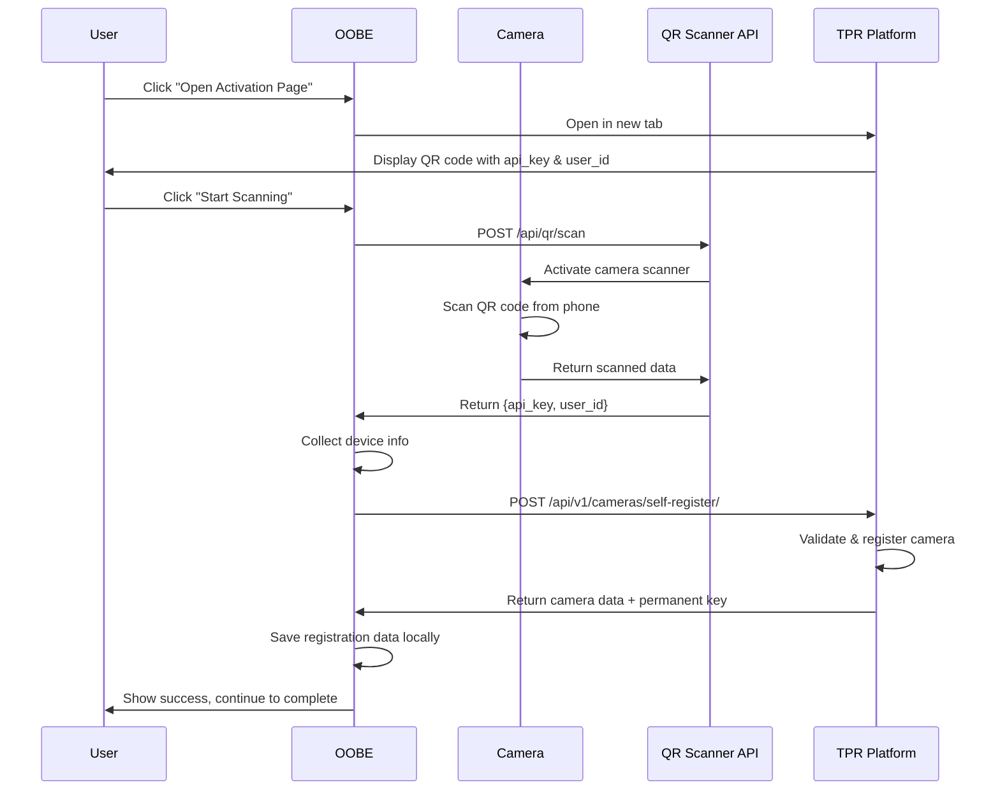

# OOBE Camera Registration - Platform API Integration

**Related Plan:** [oobe-camera-registration-step.md](oobe-camera-registration-step.md)  
**Created:** 2026-01-10

## Overview

This document details the platform API integration for camera registration during the OOBE flow. The camera will scan a QR code from The Police Record platform and use the contained credentials to self-register with the backend.

## QR Code Data Format

The QR code displayed on the platform activation page contains:

```json
{
  "api_key": "E6ntWqJr.NMpgnvmsX7oWdqLjtXQtvAyHnqvH90n7",
  "user_id": 14
}
```

**Fields:**
- `api_key` (string): API key for authenticating with The Police Record platform
- `user_id` (integer): User ID who owns this camera

## Platform API Endpoint

### Self-Register Camera

**Endpoint:** `POST /api/v1/cameras/self-register/`  
**Base URL:** `https://dev.thepolicerecord.com` (development) or `https://thepolicerecord.com` (production)  
**Authentication:** API Key (from QR code)

#### Request Headers
```
Content-Type: application/json
TPR-API-KEY: {api_key from QR code}
```

#### Request Body
```json
{
  "camera_id": "123e4567-e89b-12d3-a456-426614174000",
  "location_name": "Front Door",
  "serial_number": "abcdef123456",
  "wifi_mac_address": "00:11:22:33:44:55",
  "mac_address": "66:77:88:99:AA:BB",
  "device_model": "Seeed Studio reCamera2002w",
  "firmware_version": "1.0.0",
  "latitude": 37.7749,
  "longitude": -122.4194
}
```

#### Response (Success - 200 OK)
```json
{
  "code": 200,
  "message": "Success",
  "data": {
    "uid": "123e4567-e89b-12d3-a456-426614174000",
    "camera_id": "123e4567-e89b-12d3-a456-426614174000",
    "location_name": "Front Door",
    "serial_number": "abcdef123456",
    "wifi_mac_address": "00:11:22:33:44:55",
    "mac_address": "66:77:88:99:AA:BB",
    "device_model": "Seeed Studio reCamera2002w",
    "firmware_version": "1.0.0",
    "last_contacted": "2023-01-01T12:00:00Z",
    "installation_date": "2023-01-01T12:00:00Z",
    "creation_date": "2023-01-01T12:00:00Z",
    "latitude": 37.7749,
    "longitude": -122.4194,
    "notification_target_ids": []
  },
  "key": "secret_api_key_abc123"
}
```

**Important:** The response includes a `key` field which is the camera's permanent API key for future API calls.

#### Response (Error - 401 Unauthorized)
```json
{
  "code": 401,
  "message": "Unauthorized",
  "details": "Invalid API key"
}
```

#### Response (Error - 403 Forbidden)
```json
{
  "code": 403,
  "message": "Forbidden",
  "details": "API key does not have permission to register cameras"
}
```

## Implementation Flow

### Complete Registration Flow



## JavaScript Implementation

### Updated handleScanSuccess Function

```javascript
async handleScanSuccess(scanResult) {
  console.log('QR scan successful:', scanResult);
  
  if (!scanResult.success || !scanResult.qr_codes || scanResult.qr_codes.length === 0) {
    this.updateScanStatus('No QR code found', 'error');
    this.showError('No QR code detected. Please try again.');
    return;
  }
  
  // Get first QR code data
  const qrData = scanResult.qr_codes[0].data;
  console.log('Scanned QR code data:', qrData);
  
  this.updateScanStatus('QR code scanned successfully!', 'success');
  
  try {
    // Parse QR code data (expected to be JSON from platform)
    const qrCodeData = JSON.parse(qrData);
    
    // Validate QR code contains required fields
    if (!qrCodeData.api_key || !qrCodeData.user_id) {
      throw new Error('Invalid QR code: missing api_key or user_id');
    }
    
    // Register camera with platform
    await this.registerCameraWithPlatform(qrCodeData);
    
    // Show success and allow user to continue
    this.showInfo('Camera registered successfully! Click Continue to complete setup.');
    
    // Add continue button
    const btnGroup = document.querySelector('#step-5 .btn-group');
    if (btnGroup && !document.getElementById('continue-btn')) {
      const continueBtn = document.createElement('button');
      continueBtn.id = 'continue-btn';
      continueBtn.className = 'btn btn-success';
      continueBtn.textContent = 'Continue to Complete Setup →';
      continueBtn.onclick = () => this.handleRegistrationComplete();
      btnGroup.appendChild(continueBtn);
    }
  } catch (error) {
    console.error('Failed to process registration:', error);
    this.updateScanStatus('Registration failed', 'error');
    this.showError('Failed to register camera: ' + error.message);
  }
}
```

### New registerCameraWithPlatform Function

```javascript
async registerCameraWithPlatform(qrCodeData) {
  this.showLoading('Registering camera with platform...');
  
  try {
    // Collect device information
    const deviceInfo = this.setupData.deviceInfo || {};
    const geolocation = this.setupData.geolocation || {};
    
    // Get network MAC addresses
    let wifiMac = 'unknown';
    let ethMac = 'unknown';
    try {
      const response = await fetch('/oobe/api/getNetworkInfo');
      if (response.ok) {
        const networkInfo = await response.json();
        wifiMac = networkInfo.interfaces?.wlan0?.mac || 'unknown';
        ethMac = networkInfo.interfaces?.eth0?.mac || 'unknown';
      }
    } catch (e) {
      console.log('Could not get MAC addresses');
    }
    
    // Generate camera ID (UUID v4)
    const cameraId = this.generateUUID();
    
    // Prepare registration payload
    const registrationPayload = {
      camera_id: cameraId,
      location_name: this.setupData.deviceName || 'Unknown Location',
      serial_number: deviceInfo.sn || 'unknown',
      wifi_mac_address: wifiMac,
      mac_address: ethMac,
      device_model: deviceInfo.type || 'reCamera',
      firmware_version: deviceInfo.osVersion || 'unknown',
      latitude: geolocation.latitude || null,
      longitude: geolocation.longitude || null
    };
    
    console.log('Registering camera with platform:', registrationPayload);
    
    // Determine platform URL (use dev for now, make configurable later)
    const platformUrl = 'https://dev.thepolicerecord.com';
    
    // Call platform API
    const response = await fetch(`${platformUrl}/api/v1/cameras/self-register/`, {
      method: 'POST',
      headers: {
        'Content-Type': 'application/json',
        'TPR-API-KEY': qrCodeData.api_key
      },
      body: JSON.stringify(registrationPayload)
    });
    
    const result = await response.json();
    
    if (!response.ok || result.code !== 200) {
      throw new Error(result.message || 'Registration failed');
    }
    
    console.log('Camera registered successfully:', result.data);
    
    // Save registration data locally
    const registrationData = {
      platform_url: platformUrl,
      api_key: qrCodeData.api_key,
      camera_api_key: result.key,  // Permanent key for camera
      user_id: qrCodeData.user_id,
      camera_id: cameraId,
      camera_uid: result.data.uid,
      registered_at: new Date().toISOString(),
      camera_data: result.data
    };
    
    await this.saveRegistrationData(registrationData);
    
    this.hideLoading();
    
  } catch (error) {
    this.hideLoading();
    console.error('Platform registration error:', error);
    throw error;
  }
}

generateUUID() {
  // Simple UUID v4 generator
  return 'xxxxxxxx-xxxx-4xxx-yxxx-xxxxxxxxxxxx'.replace(/[xy]/g, function(c) {
    const r = Math.random() * 16 | 0;
    const v = c === 'x' ? r : (r & 0x3 | 0x8);
    return v.toString(16);
  });
}

async saveRegistrationData(registrationData) {
  try {
    const response = await fetch('/oobe/api/saveRegistration', {
      method: 'POST',
      headers: {
        'Content-Type': 'application/json',
      },
      body: JSON.stringify(registrationData)
    });
    
    const result = await response.json();
    if (!result.ok) {
      throw new Error(result.error || 'Failed to save registration');
    }
    
    console.log('Registration data saved successfully');
  } catch (error) {
    console.error('Error saving registration:', error);
    throw error;
  }
}
```

## Backend Implementation

### OOBE Server Endpoint

**File:** `sscma-example-sg200x/solutions/oobe/main/oobe_server.cpp`

Add endpoint to save registration data:

```cpp
// POST /oobe/api/saveRegistration
void handleSaveRegistration(struct mg_connection *c, struct mg_http_message *hm) {
    // Parse JSON body
    char body[2048];
    mg_http_get_var(&hm->body, "body", body, sizeof(body));
    
    // Save to /userdata/config/police-record.json
    FILE *f = fopen("/userdata/config/police-record.json", "w");
    if (f) {
        fprintf(f, "%s", body);
        fclose(f);
        
        // Respond with success
        mg_http_reply(c, 200, "Content-Type: application/json\r\n",
                     "{\"ok\":true,\"message\":\"Registration saved\"}");
    } else {
        mg_http_reply(c, 500, "Content-Type: application/json\r\n",
                     "{\"ok\":false,\"error\":\"Failed to save file\"}");
    }
}
```

### Saved Registration Data Format

**File:** `/userdata/config/police-record.json`

```json
{
  "platform_url": "https://dev.thepolicerecord.com",
  "api_key": "E6ntWqJr.NMpgnvmsX7oWdqLjtXQtvAyHnqvH90n7",
  "camera_api_key": "secret_api_key_abc123",
  "user_id": 14,
  "camera_id": "123e4567-e89b-12d3-a456-426614174000",
  "camera_uid": "123e4567-e89b-12d3-a456-426614174000",
  "registered_at": "2023-01-01T12:00:00Z",
  "camera_data": {
    "uid": "123e4567-e89b-12d3-a456-426614174000",
    "location_name": "Front Door",
    "serial_number": "abcdef123456",
    "wifi_mac_address": "00:11:22:33:44:55",
    "mac_address": "66:77:88:99:AA:BB",
    "device_model": "Seeed Studio reCamera2002w",
    "firmware_version": "1.0.0",
    "last_contacted": "2023-01-01T12:00:00Z",
    "installation_date": "2023-01-01T12:00:00Z",
    "creation_date": "2023-01-01T12:00:00Z",
    "latitude": 37.7749,
    "longitude": -122.4194,
    "notification_target_ids": []
  }
}
```

## Future Camera Operations

After registration, the camera can use the `camera_api_key` for future operations:

### Check for Model Updates

```javascript
const response = await fetch(`${platformUrl}/api/v1/cameras/self-register/`, {
  method: 'GET',
  headers: {
    'TPR-API-KEY': camera_api_key
  }
});
```

### Post Detection Results

```javascript
const formData = new FormData();
formData.append('image', imageBlob);
formData.append('data', JSON.stringify({
  timestamp: Date.now(),
  confidence: 0.95,
  bounding_box: [x1, y1, x2, y2],
  class_label: 'Person'
}));

const response = await fetch(`${platformUrl}/api/v1/cameras/detection/`, {
  method: 'POST',
  headers: {
    'TPR-API-KEY': camera_api_key
  },
  body: formData
});
```

### Update Camera Status

```javascript
const response = await fetch(`${platformUrl}/api/v1/cameras/update-status/`, {
  method: 'POST',
  headers: {
    'Content-Type': 'application/json',
    'TPR-API-KEY': camera_api_key
  },
  body: JSON.stringify({
    status: 'Online'
  })
});
```

## Error Handling

### Invalid API Key
```json
{
  "code": 401,
  "message": "Unauthorized",
  "details": "Invalid API key"
}
```

**Action:** Show error message, allow user to retry scan or skip registration.

### Network Error
**Action:** Show error message with retry option. Don't block OOBE completion.

### Platform Unavailable
**Action:** Show error message, allow skip. Save QR code data locally for later registration attempt.

## Security Considerations

1. **API Key Storage**
   - Store `camera_api_key` securely in `/userdata/config/police-record.json`
   - File permissions: 600 (read/write owner only)
   - Never log or display API keys

2. **HTTPS Only**
   - All platform API calls must use HTTPS
   - Validate SSL certificates
   - No fallback to HTTP

3. **QR Code Validation**
   - Validate JSON structure before parsing
   - Check for required fields (api_key, user_id)
   - Reject malformed or suspicious data

4. **Rate Limiting**
   - Implement exponential backoff for retries
   - Limit registration attempts to prevent abuse

## Testing Checklist

- [ ] QR code scanning returns correct data format
- [ ] Platform API accepts registration request
- [ ] Registration data saved to correct file
- [ ] File permissions set correctly (600)
- [ ] Error handling for invalid API key
- [ ] Error handling for network failures
- [ ] Error handling for platform unavailable
- [ ] Retry mechanism works correctly
- [ ] Skip option allows OOBE completion
- [ ] Camera can use permanent API key for future calls
- [ ] Test with both dev and production platform URLs

## Configuration

### Platform URL Configuration

Make platform URL configurable via environment variable or config file:

**File:** `/userdata/config/platform.conf`
```
PLATFORM_URL=https://dev.thepolicerecord.com
```

Or use environment variable:
```bash
export TPR_PLATFORM_URL=https://dev.thepolicerecord.com
```

### Default to Development

For safety, default to development platform during OOBE:
```javascript
const platformUrl = process.env.TPR_PLATFORM_URL || 'https://dev.thepolicerecord.com';
```

## Open Questions

1. **Platform URL Selection**
   - Should OOBE auto-detect production vs development?
   - Should user be able to select platform URL?
   - How to handle custom/self-hosted platforms?

2. **API Key Expiration**
   - Does the initial API key from QR code expire?
   - Does the permanent camera API key expire?
   - How to handle key rotation?

3. **Registration Retry**
   - If registration fails, should we save QR data for later retry?
   - Should camera automatically retry registration on boot?
   - How many retry attempts before giving up?

4. **Multiple Cameras**
   - Can one user register multiple cameras?
   - How to handle camera transfer between users?
   - How to unregister/deregister a camera?

## References

- [Main OOBE Plan](oobe-camera-registration-step.md)
- [Police Record Integration Spec](../spec/POLICE_RECORD_INTEGRATION.md)
- [Platform API Documentation](provided in feedback)
