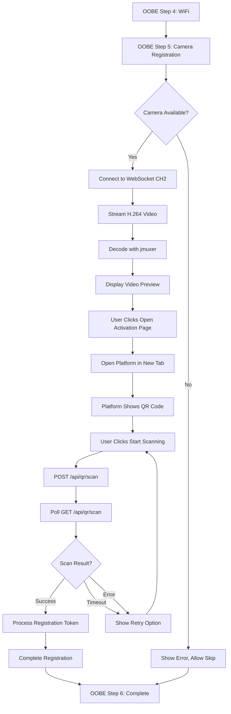

# OOBE Camera Registration Step - Implementation Plan

**Owner:** Development Team
**Created:** 2026-01-10
**Status:** Planning

## Overview

Add a new step to the Out-of-Box Experience (OOBE) flow that allows users to register their camera with The Police Record platform. This step will:
1. Display a live camera preview (Channel 2) via WebSocket streaming
2. Provide a button to open the activation page (`https://dev.thepolicerecord.com/activate/camera/`)
3. Use the supervisor's QR code scanning API to scan a QR code from the user's phone/device
4. Complete registration when QR code is successfully scanned

## Current State Analysis

### Existing OOBE Flow
The current OOBE has 5 steps:
1. **Welcome** - Introduction screen
2. **Password** - Set device password
3. **Device** - Configure location, timezone, date/time
4. **WiFi** - Connect to network
5. **Complete** - Summary and redirect

### Camera Streaming Implementation
The supervisor already implements camera streaming:
- **WebSocket Server:** Port 8765 (via Go supervisor with CGo)
- **Protocol:** Binary H.264 frames with 8-byte timestamp
- **Frontend:** Uses jmuxer for H.264 decoding
- **Multi-channel:** Supports multiple camera channels (CH1, CH2, etc.)
- **API Endpoint:** `/api/channels` returns channel list and `/api/deviceMgr/getCameraWebsocketUrl` returns WebSocket URL

### Police Record Integration
From [`spec/POLICE_RECORD_INTEGRATION.md`](../spec/POLICE_RECORD_INTEGRATION.md):
- Platform URL: `https://dev.thepolicerecord.com/activate/camera/`
- OAuth2 authentication (Auth0 or Keycloak)
- Camera registration workflow requires device identification

### Existing QR Code API
The supervisor already has QR code scanning functionality:
- **API Endpoints:**
  - `POST /api/qr/scan` - Start a QR code scan session
  - `GET /api/qr/scan?scan_id={id}` - Get scan status and results
  - `DELETE /api/qr/scan?scan_id={id}` - Cancel active scan
  - `GET /api/qr/health` - Check QR service health
- **Binary:** `/usr/bin/qr-reader` - Scans QR codes from camera feed
- **Features:**
  - Configurable timeout (default 30s)
  - Max results limit
  - Schema validation support
  - Returns decoded QR code data

## Requirements

### Functional Requirements

1. **New OOBE Step: Camera Registration**
   - Insert between "WiFi" (step 4) and "Complete" (step 5)
   - Becomes new step 5, completion becomes step 6
   - Display live camera preview from Channel 2
   - Show QR code on the video feed for scanning
   - Provide button to open activation page in new tab
   - Allow users to skip this step

2. **Camera Preview Display**
   - Stream Channel 2 video via WebSocket
   - Use jmuxer for H.264 decoding (same as supervisor overview)
   - Display in responsive video player
   - Show connection status and latency
   - Handle connection errors gracefully

3. **QR Code Scanning**
   - Use supervisor's QR code scanning API (`/api/qr/scan`)
   - Start scan when user clicks "Start Scanning" button
   - Display scan status (scanning, complete, timeout, error)
   - Show scanned QR code data when successful
   - Handle scan timeout and errors gracefully

4. **Activation Flow**
   - Button opens `https://dev.thepolicerecord.com/activate/camera/` in new tab
   - Platform displays QR code for user to show to camera
   - User clicks "Start Scanning" in OOBE
   - Camera scans QR code from user's phone/device screen
   - QR code contains registration token from platform
   - OOBE receives scanned data and completes registration
   - User can return to OOBE to complete setup

### Non-Functional Requirements

1. **Performance**
   - Video latency < 200ms
   - Smooth video playback at 30fps
   - Minimal buffering

2. **Reliability**
   - Auto-reconnect on WebSocket disconnect
   - Graceful degradation if camera unavailable
   - Clear error messages

3. **User Experience**
   - Clear instructions for registration process
   - Visual feedback for connection status
   - Option to skip and register later

## Architecture

### System Flow



### Component Architecture

```mermaid
graph LR
    A[OOBE HTML] --> B[oobe-app.js]
    B --> C[supervisor-api.js]
    C --> D[Supervisor API]
    D --> E[WebSocket Server :8765]
    E --> F[Camera CH2]
    B --> G[jmuxer Library]
    G --> H[Video Element]
    B --> I[QR Scan API]
    I --> J[/usr/bin/qr-reader]
    J --> F
```

## Implementation Plan

### Phase 1: Update OOBE HTML Structure

**File:** [`sscma-example-sg200x/solutions/oobe/web/index.html`](../sscma-example-sg200x/solutions/oobe/web/index.html)

1. **Update Progress Steps**
   - Add new step indicator for "Register"
   - Update step numbers (Complete becomes step 6)

2. **Add New Step 5: Camera Registration**
   ```html
   <!-- Step 5: Camera Registration -->
   <div id="step-5" class="setup-step hidden">
     <div class="card">
       <h2 class="card-title">Register Your Camera</h2>
       <p>Register your camera with The Police Record platform to enable cloud features.</p>
       
       <!-- Video Container -->
       <div class="video-container">
         <video id="registration-player" autoplay muted playsinline></video>
         <div id="video-status" class="video-status">
           <span id="connection-status">Connecting...</span>
           <span id="latency-display"></span>
         </div>
         <div id="scan-status" class="scan-status hidden">
           <span id="scan-status-text">Ready to scan</span>
         </div>
       </div>
       
       <!-- Instructions -->
       <div class="registration-instructions">
         <h3>How to Register:</h3>
         <ol>
           <li>Click "Open Activation Page" to open the registration page in a new tab</li>
           <li>The activation page will display a QR code on your phone/device</li>
           <li>Click "Start Scanning" below to activate the camera's QR scanner</li>
           <li>Hold your phone/device with the QR code in front of the camera</li>
           <li>Wait for the scan to complete (this may take a few seconds)</li>
         </ol>
       </div>
       
       <!-- Action Buttons -->
       <div class="btn-group">
         <button type="button" class="btn btn-secondary" onclick="oobeApp.showStep(4)">
           ← Back
         </button>
         <button type="button" class="btn btn-secondary" onclick="oobeApp.handleRegistrationSkip()">
           Skip for Now
         </button>
         <button type="button" class="btn btn-info" onclick="oobeApp.handleRegistrationOpen()">
           Open Activation Page
         </button>
         <button type="button" id="start-scan-btn" class="btn btn-primary" onclick="oobeApp.handleStartScan()">
           Start Scanning
         </button>
       </div>
     </div>
   </div>
   ```

3. **Rename Existing Step 5 to Step 6**
   - Update `id="step-5"` to `id="step-6"` for completion step
   - Update all references in JavaScript

### Phase 2: Add CSS Styling

**File:** [`sscma-example-sg200x/solutions/oobe/web/css/style.css`](../sscma-example-sg200x/solutions/oobe/web/css/style.css)

```css
/* Video Container */
.video-container {
  position: relative;
  width: 100%;
  max-width: 640px;
  margin: 1.5rem auto;
  background: #000;
  border-radius: 0.5rem;
  overflow: hidden;
}

.video-container video {
  width: 100%;
  height: auto;
  display: block;
}

.scan-status {
  position: absolute;
  top: 0;
  left: 0;
  right: 0;
  background: rgba(59, 130, 246, 0.9);
  color: white;
  padding: 0.75rem;
  text-align: center;
  font-weight: 600;
  font-size: 1rem;
}

.scan-status.scanning {
  background: rgba(234, 179, 8, 0.9);
}

.scan-status.success {
  background: rgba(34, 197, 94, 0.9);
}

.scan-status.error {
  background: rgba(239, 68, 68, 0.9);
}

.video-status {
  position: absolute;
  bottom: 0;
  left: 0;
  right: 0;
  background: rgba(0, 0, 0, 0.7);
  color: white;
  padding: 0.5rem;
  display: flex;
  justify-content: space-between;
  font-size: 0.875rem;
}

.registration-instructions {
  margin: 1.5rem 0;
  padding: 1rem;
  background: #f0f9ff;
  border-left: 4px solid #0ea5e9;
  border-radius: 0.25rem;
}

.registration-instructions h3 {
  margin-top: 0;
  margin-bottom: 0.5rem;
  font-size: 1rem;
  color: #0c4a6e;
}

.registration-instructions ol {
  margin: 0;
  padding-left: 1.5rem;
}

.registration-instructions li {
  margin-bottom: 0.5rem;
}
```

### Phase 3: Implement JavaScript Functionality

**File:** [`sscma-example-sg200x/solutions/oobe/web/js/oobe-app.js`](../sscma-example-sg200x/solutions/oobe/web/js/oobe-app.js)

#### 3.1 Add Dependencies

Include jmuxer library:
```html
<!-- In index.html, before oobe-app.js -->
<script src="https://cdn.jsdelivr.net/npm/jmuxer@2.0.5/dist/jmuxer.min.js"></script>
```

#### 3.2 Add Registration State to OOBEApp Class

```javascript
constructor() {
  // ... existing code ...
  this.registrationWebSocket = null;
  this.jmuxerInstance = null;
  this.activeScanId = null;
  this.scanPollInterval = null;
}
```

#### 3.3 Implement loadRegistrationStep()

```javascript
async loadRegistrationStep() {
  // Initialize camera stream
  await this.initializeCameraStream();
  
  // Reset scan state
  this.activeScanId = null;
  if (this.scanPollInterval) {
    clearInterval(this.scanPollInterval);
    this.scanPollInterval = null;
  }
}
```

#### 3.4 Implement Camera Streaming

```javascript
async initializeCameraStream() {
  try {
    // Get WebSocket URL for channel 2
    const wsUrl = await this.getCameraWebSocketUrl(2);
    
    // Initialize jmuxer
    this.jmuxerInstance = new JMuxer({
      node: 'registration-player',
      mode: 'video',
      flushingTime: 0,
      fps: 30,
      clearBuffer: true,
      debug: false,
      onReady: () => {
        console.log('jmuxer ready');
        this.updateConnectionStatus('Connected', 'success');
      },
      onError: (error) => {
        console.error('jmuxer error:', error);
        this.updateConnectionStatus('Error', 'error');
      }
    });
    
    // Connect WebSocket
    this.registrationWebSocket = new WebSocket(wsUrl);
    this.registrationWebSocket.binaryType = 'arraybuffer';
    
    this.registrationWebSocket.onopen = () => {
      console.log('Camera WebSocket connected');
      this.updateConnectionStatus('Streaming', 'success');
    };
    
    this.registrationWebSocket.onmessage = (event) => {
      this.handleCameraFrame(event.data);
    };
    
    this.registrationWebSocket.onerror = (error) => {
      console.error('WebSocket error:', error);
      this.updateConnectionStatus('Connection Error', 'error');
    };
    
    this.registrationWebSocket.onclose = () => {
      console.log('Camera WebSocket closed');
      this.updateConnectionStatus('Disconnected', 'warning');
    };
    
  } catch (error) {
    console.error('Failed to initialize camera stream:', error);
    this.showError('Failed to connect to camera. You can skip this step and register later.');
  }
}

async getCameraWebSocketUrl(channel) {
  // Get base WebSocket URL from supervisor API
  const response = await fetch('/api/deviceMgr/getCameraWebsocketUrl?time=' + Date.now(), {
    headers: {
      'Authorization': localStorage.getItem('authToken') || ''
    }
  });
  
  const result = await response.json();
  if (result.code === 0 && result.data) {
    let wsUrl = result.data.websocketUrl;
    const separator = wsUrl.includes('?') ? '&' : '?';
    return wsUrl + separator + 'channel=' + channel;
  }
  
  throw new Error('Failed to get WebSocket URL');
}

handleCameraFrame(data) {
  const buffer = new Uint8Array(data);
  
  // Extract timestamp (last 8 bytes)
  const lastEight = buffer.slice(-8);
  const dataView = new DataView(lastEight.buffer);
  const high = dataView.getUint32(4, true);
  const low = dataView.getUint32(0, true);
  const timestamp = Number((BigInt(high) << BigInt(32)) | BigInt(low));
  
  // Calculate latency
  const latency = Date.now() - timestamp;
  this.updateLatencyDisplay(latency);
  
  // Feed frame to jmuxer (skip channel ID byte, exclude timestamp)
  if (this.jmuxerInstance) {
    const frameData = buffer.subarray(1, buffer.length - 8);
    this.jmuxerInstance.feed({
      video: frameData
    });
  }
}

updateConnectionStatus(status, type) {
  const statusEl = document.getElementById('connection-status');
  if (statusEl) {
    statusEl.textContent = status;
    statusEl.className = 'status-' + type;
  }
}

updateLatencyDisplay(latency) {
  const latencyEl = document.getElementById('latency-display');
  if (latencyEl) {
    latencyEl.textContent = `Latency: ${latency}ms`;
  }
}
```

#### 3.5 Implement QR Code Scanning

```javascript
async handleStartScan() {
  try {
    this.showLoading('Starting QR code scan...');
    this.updateScanStatus('Initializing scan...', 'scanning');
    
    // Start QR scan via supervisor API
    const response = await fetch('/api/qr/scan', {
      method: 'POST',
      headers: {
        'Content-Type': 'application/json',
        'Authorization': localStorage.getItem('authToken') || ''
      },
      body: JSON.stringify({
        timeout: 60,  // 60 second timeout
        max_results: 1,
        schema: ''  // No schema validation for now
      })
    });
    
    const result = await response.json();
    
    if (result.code === 0 && result.data) {
      this.activeScanId = result.data.scan_id;
      console.log('QR scan started:', this.activeScanId);
      
      this.hideLoading();
      this.updateScanStatus('Scanning... Hold QR code in front of camera', 'scanning');
      
      // Disable start button during scan
      const startBtn = document.getElementById('start-scan-btn');
      if (startBtn) {
        startBtn.disabled = true;
        startBtn.textContent = 'Scanning...';
      }
      
      // Start polling for results
      this.pollScanStatus();
    } else {
      throw new Error(result.msg || 'Failed to start scan');
    }
  } catch (error) {
    console.error('Failed to start QR scan:', error);
    this.hideLoading();
    this.updateScanStatus('Failed to start scan', 'error');
    this.showError('Failed to start QR code scan: ' + error.message);
  }
}

pollScanStatus() {
  // Poll every 500ms
  this.scanPollInterval = setInterval(async () => {
    try {
      const response = await fetch(`/api/qr/scan?scan_id=${this.activeScanId}`, {
        headers: {
          'Authorization': localStorage.getItem('authToken') || ''
        }
      });
      
      const result = await response.json();
      
      if (result.code === 0 && result.data) {
        const status = result.data.status;
        
        if (status === 'scanning') {
          // Still scanning, keep polling
          return;
        }
        
        // Scan completed (success, timeout, or error)
        clearInterval(this.scanPollInterval);
        this.scanPollInterval = null;
        
        // Re-enable start button
        const startBtn = document.getElementById('start-scan-btn');
        if (startBtn) {
          startBtn.disabled = false;
          startBtn.textContent = 'Start Scanning';
        }
        
        if (status === 'complete' && result.data.result) {
          await this.handleScanSuccess(result.data.result);
        } else if (status === 'timeout') {
          this.updateScanStatus('Scan timed out. Please try again.', 'error');
          this.showError('QR code scan timed out. Click "Start Scanning" to try again.');
        } else if (status === 'cancelled') {
          this.updateScanStatus('Scan cancelled', 'error');
        } else {
          this.updateScanStatus('Scan failed', 'error');
          this.showError('QR code scan failed. Please try again.');
        }
      }
    } catch (error) {
      console.error('Error polling scan status:', error);
      clearInterval(this.scanPollInterval);
      this.scanPollInterval = null;
      this.updateScanStatus('Error checking scan status', 'error');
    }
  }, 500);
}

async handleScanSuccess(scanResult) {
  console.log('QR scan successful:', scanResult);
  
  if (!scanResult.success || !scanResult.qr_codes || scanResult.qr_codes.length === 0) {
    this.updateScanStatus('No QR code found', 'error');
    this.showError('No QR code detected. Please try again.');
    return;
  }
  
  // Get first QR code data
  const qrData = scanResult.qr_codes[0].data;
  console.log('Scanned QR code data:', qrData);
  
  this.updateScanStatus('QR code scanned successfully!', 'success');
  
  try {
    // Parse QR code data (expected to be JSON from platform)
    const registrationData = JSON.parse(qrData);
    
    // Process registration
    await this.processRegistration(registrationData);
    
    // Show success and allow user to continue
    this.showInfo('Camera registered successfully! Click Continue to complete setup.');
    
    // Add continue button
    const btnGroup = document.querySelector('#step-5 .btn-group');
    if (btnGroup && !document.getElementById('continue-btn')) {
      const continueBtn = document.createElement('button');
      continueBtn.id = 'continue-btn';
      continueBtn.className = 'btn btn-success';
      continueBtn.textContent = 'Continue to Complete Setup →';
      continueBtn.onclick = () => this.handleRegistrationComplete();
      btnGroup.appendChild(continueBtn);
    }
  } catch (error) {
    console.error('Failed to process registration:', error);
    this.updateScanStatus('Invalid QR code data', 'error');
    this.showError('Invalid QR code. Please scan the QR code from the activation page.');
  }
}

async processRegistration(registrationData) {
  // Save registration data to device
  try {
    const response = await fetch('/oobe/api/saveRegistration', {
      method: 'POST',
      headers: {
        'Content-Type': 'application/json',
      },
      body: JSON.stringify(registrationData)
    });
    
    const result = await response.json();
    if (!result.ok) {
      throw new Error(result.error || 'Failed to save registration');
    }
    
    console.log('Registration data saved successfully');
  } catch (error) {
    console.error('Error saving registration:', error);
    throw error;
  }
}

updateScanStatus(message, type) {
  const statusEl = document.getElementById('scan-status');
  const textEl = document.getElementById('scan-status-text');
  
  if (statusEl && textEl) {
    textEl.textContent = message;
    statusEl.className = 'scan-status ' + type;
    statusEl.classList.remove('hidden');
  }
}
```

#### 3.6 Implement Step Navigation

```javascript
async handleWiFiNext() {
  // ... existing WiFi connection code ...
  
  // After successful WiFi connection, go to registration step
  this.showStep(5);
}

handleRegistrationOpen() {
  // Open activation page in new tab
  window.open('https://dev.thepolicerecord.com/activate/camera/', '_blank');
  
  // Show instructions
  this.showInfo('The activation page has opened in a new tab. Follow the instructions there to get your QR code, then click "Start Scanning" below.');
}

handleRegistrationSkip() {
  if (confirm('Are you sure you want to skip camera registration? You can register later from the settings page.')) {
    this.cleanupRegistration();
    this.showStep(6);
  }
}

handleRegistrationComplete() {
  this.cleanupRegistration();
  this.showStep(6);
}

cleanupRegistration() {
  // Stop scan polling
  if (this.scanPollInterval) {
    clearInterval(this.scanPollInterval);
    this.scanPollInterval = null;
  }
  
  // Cancel active scan if any
  if (this.activeScanId) {
    fetch(`/api/qr/scan?scan_id=${this.activeScanId}`, {
      method: 'DELETE',
      headers: {
        'Authorization': localStorage.getItem('authToken') || ''
      }
    }).catch(err => console.log('Error cancelling scan:', err));
    
    this.activeScanId = null;
  }
  
  // Close WebSocket
  if (this.registrationWebSocket) {
    this.registrationWebSocket.close();
    this.registrationWebSocket = null;
  }
  
  // Destroy jmuxer
  if (this.jmuxerInstance) {
    this.jmuxerInstance.destroy();
    this.jmuxerInstance = null;
  }
}
```

#### 3.7 Update showStep() Method

```javascript
showStep(step) {
  this.currentStep = step;
  
  // ... existing code ...
  
  // Load step content
  switch (step) {
    case 1:
      this.loadWelcomeStep();
      break;
    case 2:
      this.loadPasswordStep();
      break;
    case 3:
      this.loadDeviceConfigStep();
      break;
    case 4:
      this.loadWiFiStep();
      break;
    case 5:
      this.loadRegistrationStep();
      break;
    case 6:
      this.loadCompletionStep();
      break;
  }
}
```

#### 3.8 Update handleComplete() Method

```javascript
async handleComplete() {
  this.showLoading('Finalizing setup...');
  
  // ... existing device info saving code ...
  
  // Redirect to main dashboard instead of activation page
  setTimeout(() => {
    window.location.href = '/';
  }, 2000);
}
```

### Phase 4: Update Supervisor API (if needed)

**File:** [`sscma-example-sg200x/solutions/supervisor/internal/handler/camera.go`](../sscma-example-sg200x/solutions/supervisor/internal/handler/camera.go)

Verify that the existing camera API supports:
1. Channel selection via query parameter
2. Multiple concurrent WebSocket connections
3. Proper authentication for OOBE context

If modifications are needed, document them separately.

### Phase 5: Backend Integration

**File:** Create new file for activation token management

1. **Generate Activation Token**
   - Create endpoint: `POST /oobe/api/generateActivationToken`
   - Returns cryptographically secure token
   - Store token with device info for validation

2. **Validate Registration**
   - Create endpoint: `GET /oobe/api/registrationStatus`
   - Check if device has been registered with platform
   - Return registration status

### Phase 6: Testing Plan

#### Unit Tests
- [ ] QR code generation with device data
- [ ] WebSocket connection handling
- [ ] jmuxer initialization and cleanup
- [ ] Step navigation logic

#### Integration Tests
- [ ] Full OOBE flow with registration step
- [ ] Camera streaming on Channel 2
- [ ] QR code scanning from mobile device
- [ ] Platform activation workflow
- [ ] Skip registration flow

#### Manual Testing Checklist
- [ ] Video streams correctly on registration step
- [ ] QR code is visible and scannable
- [ ] Activation page opens in new tab
- [ ] Can complete registration and return to OOBE
- [ ] Can skip registration and complete setup
- [ ] Back button works correctly
- [ ] Connection errors handled gracefully
- [ ] Works on different screen sizes
- [ ] Works with different network conditions

## Security Considerations

1. **Activation Token**
   - Use cryptographically secure random generation
   - Token should be single-use
   - Token should expire after reasonable time (e.g., 1 hour)
   - Store token hash, not plaintext

2. **Device Identification**
   - Don't expose sensitive information in QR code
   - Use device serial number as primary identifier
   - Validate device ownership on platform side

3. **WebSocket Security**
   - Ensure authentication token is valid
   - Rate limit connection attempts
   - Validate channel access permissions

## Error Handling

### Camera Unavailable
- Show clear error message
- Provide "Skip" option prominently
- Log error for debugging

### WebSocket Connection Failure
- Implement exponential backoff retry
- Show connection status to user
- Allow manual retry

### QR Code Generation Failure
- Fall back to text-based activation code
- Provide manual entry option on platform

### Platform Registration Timeout
- Don't block OOBE completion
- Allow user to continue and register later
- Provide link to registration in settings

## Future Enhancements

1. **Registration Status Polling**
   - Poll platform API to detect when registration completes
   - Auto-advance to completion step when registered
   - Show real-time registration status

2. **Multiple Registration Methods**
   - QR code scanning (primary)
   - Manual code entry (fallback)
   - NFC pairing (future)

3. **Registration Verification**
   - Verify registration completed successfully
   - Show confirmation message
   - Test platform connectivity

4. **Offline Registration**
   - Queue registration for later
   - Retry when network available
   - Notify user when complete

## Documentation Updates

### User Documentation
- [ ] Update OOBE user guide with registration step
- [ ] Create camera registration tutorial
- [ ] Document skip and later registration process

### Developer Documentation
- [ ] Update OOBE flow diagram
- [ ] Document camera streaming API
- [ ] Document activation token format
- [ ] Update API reference

### Specification Updates
- [ ] Update [`spec/OOBE_FLOW.md`](../spec/OOBE_FLOW.md) with new step
- [ ] Update [`spec/POLICE_RECORD_INTEGRATION.md`](../spec/POLICE_RECORD_INTEGRATION.md) with activation flow
- [ ] Create camera registration specification

## Implementation Checklist

### Phase 1: HTML/CSS (Code Mode)
- [ ] Update progress steps in [`index.html`](../sscma-example-sg200x/solutions/oobe/web/index.html)
- [ ] Add step 5 HTML structure
- [ ] Rename step 5 to step 6 (completion)
- [ ] Add CSS styles to [`style.css`](../sscma-example-sg200x/solutions/oobe/web/css/style.css)
- [ ] Test responsive layout

### Phase 2: JavaScript Core (Code Mode)
- [ ] Add jmuxer and QRCode library includes
- [ ] Add registration state to OOBEApp constructor
- [ ] Implement `loadRegistrationStep()`
- [ ] Implement `initializeCameraStream()`
- [ ] Implement `getCameraWebSocketUrl()`
- [ ] Implement `handleCameraFrame()`
- [ ] Test camera streaming

### Phase 3: QR Code (Code Mode)
- [ ] Implement `generateQRCodeData()`
- [ ] Implement `generateActivationToken()`
- [ ] Implement `drawQRCode()`
- [ ] Test QR code generation and scanning

### Phase 4: Navigation (Code Mode)
- [ ] Update `showStep()` method
- [ ] Implement `handleRegistrationOpen()`
- [ ] Implement `handleRegistrationSkip()`
- [ ] Implement `handleRegistrationComplete()`
- [ ] Implement `cleanupRegistration()`
- [ ] Update `handleWiFiNext()`
- [ ] Update `handleComplete()`
- [ ] Test step navigation

### Phase 5: Backend (Code Mode)
- [ ] Create activation token generation endpoint
- [ ] Create registration status endpoint
- [ ] Implement token storage and validation
- [ ] Test API endpoints

### Phase 6: Testing (Debug Mode)
- [ ] Test full OOBE flow
- [ ] Test camera streaming
- [ ] Test QR code scanning
- [ ] Test skip functionality
- [ ] Test error handling
- [ ] Test on different devices

### Phase 7: Documentation (Architect Mode)
- [ ] Update OOBE specification
- [ ] Update Police Record integration spec
- [ ] Create user guide
- [ ] Update API documentation

## Dependencies

### External Libraries
- **jmuxer** (v2.0.5): H.264 video decoding
- **qrcode** (v1.5.3): QR code generation

### Internal Dependencies
- Supervisor camera streaming API
- OOBE server API
- Police Record platform activation API

### Browser Requirements
- WebSocket support
- HTML5 video support
- Canvas API support
- ES6+ JavaScript support

## Rollout Plan

### Phase 1: Development (Week 1-2)
- Implement HTML/CSS changes
- Implement JavaScript functionality
- Create backend endpoints
- Unit testing

### Phase 2: Integration Testing (Week 3)
- Test full OOBE flow
- Test camera streaming
- Test platform integration
- Fix bugs

### Phase 3: User Acceptance Testing (Week 4)
- Test with real devices
- Test QR code scanning
- Gather user feedback
- Refine UX

### Phase 4: Deployment (Week 5)
- Deploy to staging environment
- Final testing
- Deploy to production
- Monitor for issues

## Success Metrics

1. **Completion Rate**
   - Target: >80% of users complete registration
   - Measure: Track registration step completion vs. skip

2. **Time to Complete**
   - Target: <2 minutes for registration step
   - Measure: Time from step load to completion

3. **Error Rate**
   - Target: <5% encounter errors
   - Measure: Track WebSocket failures, QR code errors

4. **User Satisfaction**
   - Target: >4.0/5.0 rating
   - Measure: Post-setup survey

## Open Questions

1. **Activation Token Security**
   - Should tokens be generated on device or server?
   - What's the appropriate token expiration time?
   - How to handle token refresh?

2. **Registration Verification**
   - Should OOBE poll platform for registration status?
   - How long to wait before allowing skip?
   - Should registration be required or optional?

3. **Channel Selection**
   - Why use Channel 2 instead of Channel 1?
   - Should channel be configurable?
   - What if Channel 2 is not available?

4. **Platform Integration**
   - Does platform API support device registration via QR code?
   - What data format does platform expect?
   - How to handle registration errors?

## References

- [OOBE Flow Specification](../spec/OOBE_FLOW.md)
- [Police Record Integration](../spec/POLICE_RECORD_INTEGRATION.md)
- [Camera Streaming Documentation](../sscma-example-sg200x/solutions/supervisor/CAMERA_STREAMING.md)
- [Supervisor Overview Hook](../sscma-example-sg200x/solutions/supervisor/www/src/views/overview/hook.ts)
- [jmuxer Documentation](https://github.com/samirkumardas/jmuxer)
- [QRCode.js Documentation](https://github.com/davidshimjs/qrcodejs)
