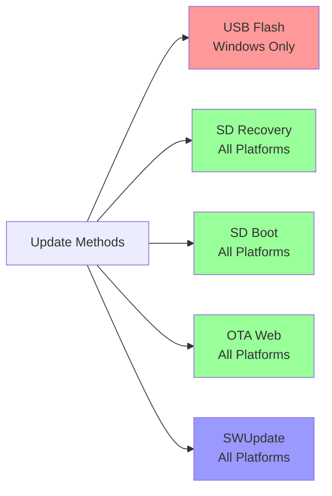

# ReCamera Complete Update/Upgrade Guide

## Overview - 5 Update Methods Comparison



---

## Method 1: USB Direct Flash (Windows Only)

### Package File: `sg2002_reCamera_X.X.X_emmc.zip`

### Purpose
- Initial installation to eMMC
- Complete system recovery
- Set custom MAC address
- Factory reset

### Requirements
- **Windows PC only**
- USB Type-C cable
- CviUsbDownload driver
- CviBurn CLI tool

### Step-by-Step (Windows)

**1. Install Driver**
```powershell
# Download from GitHub releases
https://github.com/ThePoliceRecord/authority-alert-OS/releases/download/0.0.1/CviUsbDownloadInstallDriver.zip

# Extract and run installer
# Install-CviUsbDriver.exe
```

**2. Download Tools**
```powershell
# Download CviBurn CLI
https://github.com/ThePoliceRecord/authority-alert-OS/releases/download/0.0.1/CviBurn_v2.0_cli_windows.zip

# Extract to folder, e.g., C:\CviBurn
cd C:\CviBurn
```

**3. Prepare Firmware**
```powershell
# Extract your firmware package
# sg2002_reCamera_X.X.X_emmc.zip → folder
```

**4. Flash Device**
```powershell
# Basic flash (auto MAC address)
usb_dl.exe -c cv181x -s linux -i ..\sg2002_reCamera_X.X.X_emmc

# With custom MAC address
usb_dl.exe -c cv181x -s linux -i ..\sg2002_reCamera_X.X.X_emmc -m AA:BB:CC:DD:EE:FF
```

**5. Enter Boot Mode**
- Power off device
- Connect USB-C cable
- Device should enter download mode automatically
- Tool will detect and flash

### Troubleshooting (Windows)
- **Device not detected**: Check Device Manager for USB driver status
- **Flash failed**: Try different USB port (USB 2.0 ports work better)
- **Permission denied**: Run Command Prompt as Administrator

---

## Method 2: SD Card Recovery (All Platforms)

### Package File: `sg2002_reCamera_X.X.X_emmc_recovery.zip`

### Purpose
- Flash eMMC without USB cable
- Field deployment
- Hands-free installation
- Factory programming

### Requirements
- SD card (8GB+ recommended)
- SD card reader
- balenaEtcher or `dd`

### Step-by-Step (Windows)

**1. Download balenaEtcher**
```
https://etcher.balena.io/#download-etcher
```

**2. Flash SD Card**
```
1. Launch balenaEtcher
2. "Flash from file" → select sg2002_reCamera_X.X.X_emmc_recovery.zip
3. "Select target" → choose your SD card
4. Click "Flash!"
5. Wait for verification to complete
```

### Step-by-Step (Linux)

**Option A: Using balenaEtcher (GUI)**
```bash
# Download AppImage
wget https://github.com/balena-io/etcher/releases/download/v1.18.11/balenaEtcher-1.18.11-x64.AppImage

# Make executable
chmod +x balenaEtcher-*.AppImage

# Run
./balenaEtcher-*.AppImage
# Same steps as Windows
```

**Option B: Using `dd` (Command Line)**
```bash
# Find SD card device
lsblk

# Unzip firmware
unzip sg2002_reCamera_X.X.X_emmc_recovery.zip

# Flash to SD card (replace /dev/sdX with your device)
sudo dd if=sg2002_reCamera_recovery.img of=/dev/sdX bs=4M conv=fsync status=progress

# Sync and eject
sync
sudo eject /dev/sdX
```

### Step-by-Step (macOS)

**Option A: Using balenaEtcher (GUI)**
```bash
# Download DMG
https://etcher.balena.io/#download-etcher

# Install and run
# Same steps as Windows
```

**Option B: Using `dd` (Command Line)**
```bash
# Find SD card device
diskutil list

# Unmount SD card (replace diskN with your disk)
diskutil unmountDisk /dev/diskN

# Unzip firmware
unzip sg2002_reCamera_X.X.X_emmc_recovery.zip

# Flash to SD card (use rdiskN for faster speeds)
sudo dd if=sg2002_reCamera_recovery.img of=/dev/rdiskN bs=4m

# Eject
diskutil eject /dev/diskN
```

**3. Boot & Install**
```bash
1. Insert SD card into reCamera
2. Power on device
3. Automatic installation begins
4. LED will blink during flashing
5. System reboots when complete
6. Remove SD card after bootup
```

---

## Method 3: SD Card Boot (All Platforms)

### Package File: `sg2002_reCamera_X.X.X_emmc_sd_compat.zip`

### Purpose
- Test firmware without touching eMMC
- Multiple configurations
- Development/debugging
- Temporary deployment

### Requirements
- SD card (16GB+ recommended)
- SD card reader
- balenaEtcher or `dd`

### Step-by-Step (Same as Recovery)

**Windows:**
```
Use balenaEtcher to flash sg2002_reCamera_X.X.X_emmc_sd_compat.zip to SD card
```

**Linux:**
```bash
# Using balenaEtcher AppImage
./balenaEtcher-*.AppImage

# Or using dd
sudo dd if=sg2002_reCamera_sd_compat.img of=/dev/sdX bs=4M conv=fsync status=progress
```

**macOS:**
```bash
# Using balenaEtcher DMG
# Or using dd
sudo dd if=sg2002_reCamera_sd_compat.img of=/dev/rdiskN bs=4m
```

**Usage:**
```bash
1. Insert SD card
2. Power on
3. System boots from SD (eMMC ignored)
4. SD card must remain inserted
```

### Switching Back to eMMC
```bash
# Simply remove SD card and reboot
# Device will boot from eMMC
```

---

## Method 4: OTA Web Update (All Platforms)

### Package File: `sg2002_reCamera_X.X.X_emmc_ota.zip`

### Purpose
- Production system updates
- Remote updates
- Preserve user data
- Incremental updates

### Requirements
- Working network connection
- Browser (Chrome/Firefox/Edge/Safari)
- OTA package file

### Step-by-Step (Windows/Linux/Mac)

**Option A: WebUI Upload (Recommended)**
```http
1. Connect to reCamera:
   - WiFi: http://192.168.4.1 (AP mode)
   - Network: http://<device-ip>
   
2. Navigate to System → Firmware Update

3. Select OTA Package:
   - Click "Choose File"
   - Select sg2002_reCamera_X.X.X_emmc_ota.zip
   
4. Start Update:
   - Click "Upload"
   - Wait for upload (progress bar)
   - System will verify and install
   - Automatic reboot

5. Verify Update:
   - Check System → About for new version
```

**Option B: Command Line (SSH/Serial)**

**Windows (PowerShell with OpenSSH)**
```powershell
# Copy OTA package to device
scp sg2002_reCamera_X.X.X_emmc_ota.zip recamera@<device-ip>:/tmp/

# SSH into device
ssh recamera@<device-ip>

# Run upgrade script
sudo /mnt/system/upgrade.sh start /tmp/sg2002_reCamera_X.X.X_emmc_ota.zip

# Monitor progress
tail -f /var/log/upgrade.log
```

**Linux/Mac (Native SSH)**
```bash
# Copy OTA package
scp sg2002_reCamera_X.X.X_emmc_ota.zip recamera@<device-ip>:/tmp/

# SSH into device
ssh recamera@<device-ip>

# Run upgrade
sudo /mnt/system/upgrade.sh start /tmp/sg2002_reCamera_X.X.X_emmc_ota.zip

# Monitor
tail -f /var/log/upgrade.log
```

**Option C: Network URL**
```bash
# SSH into device
ssh recamera@<device-ip>

# Download and install
cd /tmp
wget http://your-server/sg2002_reCamera_X.X.X_emmc_ota.zip
sudo /mnt/system/upgrade.sh start /tmp/sg2002_reCamera_X.X.X_emmc_ota.zip
```

---

## OTA Update Rollback

The reCamera uses an A/B partition scheme for OTA updates, allowing you to rollback to the previous firmware version if an update causes issues.

### Partition Layout

- **Partition A**: `/dev/mmcblk0p3` - Primary rootfs
- **Partition B**: `/dev/mmcblk0p4` - Secondary rootfs
- **U-Boot Environment**: Controls which partition boots

### When to Rollback

- SSH or network services fail after update
- System instability or crashes
- Incompatible firmware features
- Testing different firmware versions

### Rollback Methods

**Method 1: Using fw_setenv (Recommended)**

```bash
# Check which partition you're currently using
fw_printenv use_part_b

# If use_part_b=1 (currently on Partition B), rollback to Partition A:
fw_setenv use_part_b 0
reboot

# If use_part_b=0 (currently on Partition A), rollback to Partition B:
fw_setenv use_part_b 1
reboot
```

**Method 2: Automatic Rollback Flag**

```bash
# Set boot_rollback flag (bootloader will switch partitions automatically)
fw_setenv boot_rollback 1
reboot
```

### Verify Current Partition

```bash
# Check system mount point
mount | grep "/ "
# Will show either /dev/mmcblk0p3 or /dev/mmcblk0p4

# Check U-Boot environment variables
fw_printenv | grep -E "(use_part_b|boot_failed_limits|boot_rollback)"

# Check current firmware version
cat /etc/os-release
```

### Rollback Boot Protection

The system includes automatic boot failure protection:

- **Boot attempt counter**: Tracks failed boots
- **Boot failure limit**: Default is 5 attempts (configurable)
- **Automatic rollback**: If boot failures exceed limit, system automatically switches partitions

```bash
# Check boot failure settings
fw_printenv boot_failed_limits
# Default: 5

# Manually reset boot counter (if needed)
fw_setenv boot_rollback ""
```

### Troubleshooting Rollback

**Issue: fw_printenv/fw_setenv not found**
```bash
# Alternative: Edit U-Boot environment directly (advanced)
# Requires serial console access
# Access U-Boot console during boot
# Press any key during countdown
# Run: setenv use_part_b 0; saveenv; reset
```

**Issue: Both partitions have problems**
```bash
# Use SD Card Recovery method (see Method 2 above)
# Flash complete firmware to eMMC
```

**Issue: Rollback didn't help**
```bash
# Perform factory reset with USB Direct Flash (Method 1)
# or SD Card Recovery (Method 2)
```

### After Rollback

1. **Verify Services**: Check that SSH, network, and critical services work
2. **Check Logs**: Review system logs to identify what went wrong
   ```bash
   dmesg | less
   cat /var/log/messages
   ```
3. **Report Issues**: Document the problem before attempting another update
4. **Test Updates**: Try updates on a test device first before production deployment

---

## Method 5: SWUpdate (All Platforms)

### Package File: `*.swu` (custom build required)

### Purpose
- Production A/B updates
- Atomic transactions
- Automatic rollback
- Mission-critical systems

### Status
**Disabled by default** - Enable manually if needed

### Step-by-Step (Windows/Linux/Mac)

**Enable SWUpdate**
```bash
# SSH into device
ssh recamera@<device-ip>

# Start SWUpdate daemon
sudo /usr/lib/swupdate/swupdate.sh
```

**Web Interface**
```http
1. Access: http://<device-ip>:8080
2. Upload .swu package
3. Monitor progress via WebSocket
4. Automatic verification and installation
```

**Command Line**
```bash
# Local file
swupdate -i /path/to/update.swu

# Remote URL
swupdate -d "-u http://server/update.swu"

# With WebSocket progress
swupdate -w "-document_root /var/www/swupdate" -i update.swu
```

---

## Quick Reference Table

| Method | Windows | Linux | Mac | Network | Physical | Preserves Data | Rollback |
|--------|---------|-------|-----|---------|----------|----------------|----------|
| USB Flash | ✅ | ❌ | ❌ | No | Required | ❌ | No |
| SD Recovery | ✅ | ✅ | ✅ | No | Required | ❌ | No |
| SD Boot | ✅ | ✅ | ✅ | No | Required | N/A | Manual |
| OTA Web | ✅ | ✅ | ✅ | Required | No | ✅ | Manual |
| SWUpdate | ✅ | ✅ | ✅ | Required | No | ✅ | Auto |

---

## Common Troubleshooting

### All Methods
- **Checksum mismatch**: Re-download firmware package
- **Insufficient space**: Clear `/tmp` or `/userdata`
- **Permission denied**: Use `sudo` or run as administrator

### USB Flash (Windows)
- **Driver not detected**: Reinstall CviUsbDownload driver
- **Flash timeout**: Use USB 2.0 port, avoid USB hubs
- **Device in wrong mode**: Power cycle device completely

### SD Card Methods
- **Won't boot from SD**: Check SD card format (FAT32/ext4)
- **Slow performance**: Use Class 10 or UHS-I SD card
- **Corruption**: Use `sync` command before removing

### OTA Updates
- **Upload fails**: Check network stability, try smaller files
- **Update verify failed**: Re-download OTA package
- **Boot loop after update**: Manual recovery with SD card method

---

## Best Practices

**Development:**
- Use SD Boot for testing
- Keep SD card with recovery image handy

**Production:**
- Start with USB Flash for initial deployment
- Use OTA Web for routine updates
- Enable SWUpdate for critical deployments

**Fleet Management:**
- Automate OTA via scripts
- Use SWUpdate's Suricatta for centralized management
- Test updates on subset before full deployment

---

## Related Documentation

- [reCamera README](../reCamera-OS/README.md)
- [CHANGELOG](../reCamera-OS/CHANGELOG.md)
- [Node-RED UI Guide](NODERED_UI.md)
- [SWUpdate Package Configuration](../reCamera-OS/buildroot-2021.05/package/swupdate/)
