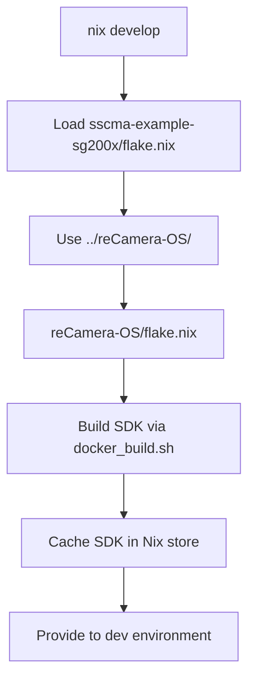

# SSCMA Example for SG200X

Development environment and examples for the SSCMA (Seeed SenseCraft Model Assistant) on SG200X RISC-V platforms.

> **Note**: This directory is part of the `authority-alert` monorepo. The SDK from `reCamera-OS/` (sibling directory) is automatically available.

## Quick Start

This project uses Nix flakes for a fully reproducible development environment. The reCamera-OS SDK is automatically built from the local reCamera-OS directory.

### Prerequisites

- **Nix** with flakes enabled ([Install Nix](https://nixos.org/download.html))
- **Docker** daemon running (required for SDK build)
- **~30GB disk space** for SDK build artifacts
- **1-2 hours** for first-time SDK build (cached thereafter)

### Setup

```bash
# Clone the monorepo
git clone https://github.com/ThePoliceRecord/authority-alert.git
cd authority-alert

# Pull Git LFS files (toolchains)
git lfs pull

# Enter development environment (from sscma-example-sg200x)
cd sscma-example-sg200x
nix develop
```

## How It Works

### Architecture (Monorepo)

Since this is part of the `authority-alert` monorepo, the reCamera-OS SDK is always available as a sibling directory:



### SDK Resolution

1. **Local reCamera-OS** (Always available in monorepo)
   - Uses `../reCamera-OS/flake.nix`
   - Builds SDK using reCamera-OS's own flake
   - Shared cache between projects

2. **Existing Local Build** (Fast)
   - If `../reCamera-OS/output/sg2002_recamera_emmc/` exists
   - Reuses already-built SDK
   - No rebuild needed

### First Run Timeline

**With local reCamera-OS flake:**
```bash
$ cd sscma-example-sg200x
$ nix develop
Loading reCamera-OS flake from ../reCamera-OS
Building SDK (first time: 1-2 hours)...
[... build progress ...]
✓ SDK cached in Nix store
✓ Development environment ready
```

**Subsequent runs:** <1 minute

### Updating the SDK

The SDK is built from `../reCamera-OS/`. To update:

```bash
# Rebuild SDK after changes to reCamera-OS
nix develop --rebuild
```

## Development

### Build a Solution

```bash
cd solutions/helloworld
cmake -B build -DCMAKE_BUILD_TYPE=Release .
cmake --build build
```

### Available Environment Variables

Inside `nix develop`:
- `$TOOLCHAIN_PATH` - RISC-V gcc toolchain
- `$SG200X_SDK_PATH` - Complete SDK root
- `$TPU_SDK_PATH` - TPU runtime and libraries
- `$PROJECT_ROOT` - Your project root
- `$PKG_CONFIG_PATH` - SDK pkg-config files
- `$LD_LIBRARY_PATH` - SDK shared libraries

### SDK Structure

The built SDK (from reCamera-OS) contains:
```
sg2002_recamera_emmc/
├── buildroot-2021.05/
│   └── output/cvitek_CV181X_musl_riscv64/
│       └── host/riscv64-buildroot-linux-musl/sysroot/
├── cvi_mpi/           # Media processing interface
│   ├── include/
│   ├── lib/
│   └── modules/
├── cvi_rtsp/          # RTSP streaming
│   └── install/
├── install/soc_sg2002_recamera_emmc/
│   ├── rootfs/mnt/system/lib/   # System libraries
│   └── tpu_musl_riscv64/cvitek_tpu_sdk/
│       ├── include/   # TPU headers (cviruntime, cvikernel)
│       ├── lib/       # TPU libraries
│       ├── opencv/    # OpenCV for embedded
│       │   ├── include/
│       │   └── lib/
│       ├── cmake/     # CMake toolchain files
│       └── samples/   # Example apps
├── osdrv/interdrv/    # OS drivers
└── build_output/      # Full build artifacts (for reference)
```

## Working with reCamera-OS

### Customizing SDK Build

1. **Modify reCamera-OS:**
```bash
cd ../reCamera-OS
# Make your changes to the SDK
vim external/configs/sg2002_recamera_emmc_defconfig
```

2. **Rebuild SDK:**
```bash
# Option A: Using reCamera-OS flake directly
nix build .#sdk-sg2002_recamera_emmc

# Option B: Rebuild from sscma-example (will use updated reCamera-OS)
cd ../sscma-example-sg200x
nix develop --rebuild
```

### Build reCamera-OS Manually

If you want to build outside of Nix:
```bash
cd ../reCamera-OS
./docker_build.sh sg2002_recamera_emmc
# SDK output: ./output/sg2002_recamera_emmc/
```

The Nix environment will automatically detect and use this build.

### Build from Monorepo Root

You can also build from the monorepo root:
```bash
cd ..  # authority-alert/
nix run .#build
```

## Binary Cache Setup (For Teams)

### Using Cachix

Share built SDKs across your team:

```bash
# Maintainer: Set up cache
cachix create sscma-sg200x

# Build and push to cache
cd ../reCamera-OS
nix build .#sdk-sg2002_recamera_emmc
cachix push sscma-sg200x $(nix path-info .#sdk-sg2002_recamera_emmc)

# Contributors: Add to flake.nix
nixConfig = {
  extra-substituters = [ "https://sscma-sg200x.cachix.org" ];
  extra-trusted-public-keys = [ "sscma-sg200x.cachix.org-1:..." ];
};
```

## Troubleshooting

### "SDK not found" in Development Environment

If SDK path exists but appears empty:
```bash
# Check build info
cat $(nix path-info .#recamera-sdk)/sg2002_recamera_emmc/.nix-build-info

# Force rebuild
nix build .#recamera-sdk --rebuild
```

### Docker Daemon Not Running

```bash
Error: Cannot connect to Docker daemon
```

**Solution**: Start Docker:
```bash
sudo systemctl start docker  # Linux
# or Docker Desktop          # macOS/Windows
```

### Disk Space Issues

SDK build needs ~30GB:
```bash
# Check space
df -h

# Clean old builds
nix-collect-garbage -d
docker system prune -a

#Clean reCamera-OS output
cd ../reCamera-OS
rm -rf output/
```

### SDK Seems Out of Date

**Cause:** Nix is using cached SDK

**Solution:**
```bash
# Force rebuild from sscma-example
nix develop --rebuild

# Or rebuild SDK from monorepo root
cd ..
nix run .#build
```

### Manual Build vs Nix Build

If you built reCamera-OS manually, Nix will detect and use it:
```bash
# Manual build
cd ../reCamera-OS
./docker_build.sh sg2002_recamera_emmc

# The Nix environment will detect output/sg2002_recamera_emmc/
nix develop  # Will use existing build
```

## Project Structure

```
authority-alert/                    # Monorepo root
├── flake.nix                       # Main Nix flake
├── reCamera-OS/                    # OS/SDK (inline directory)
│   ├── docker_build.sh
│   ├── Makefile
│   ├── host-tools/                 # Toolchains (Git LFS)
│   └── output/                     # Build artifacts
└── sscma-example-sg200x/           # This directory
    ├── flake.nix                   # SSCMA Nix flake
    ├── solutions/                  # Example applications
    │   ├── camera-detector/
    │   ├── camera-streamer/
    │   ├── supervisor/
    │   └── oobe/
    ├── components/                 # Reusable components
    ├── cmake/                      # CMake helpers
    └── scripts/                    # Build and deploy scripts
```

## Code Style

- C/C++: Follow `.clang-format` rules
- Nix: Follow `nixpkgs` style guide
- Commit messages: Conventional Commits format

```bash
# Format code before commit
clang-format -i solutions/**/*.{c,cpp,h}
```

## Contributing

See [CONTRIBUTING.md](CONTRIBUTING.md) for detailed development guidelines.

## License

See [LICENSE](LICENSE) for details.
